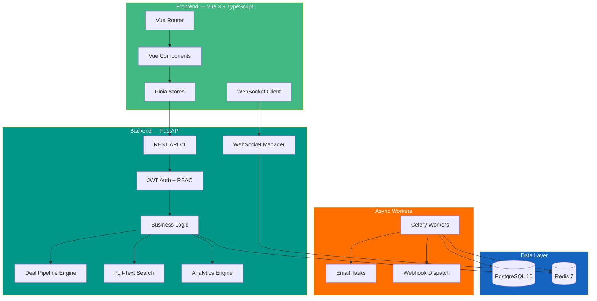

<div align="center">


<a href="#">
  
</a>

<br/>
<br/>

[](https://python.org)
[](https://fastapi.tiangolo.com)
[](https://vuejs.org)
[](https://typescriptlang.org)
[](https://postgresql.org)
[](https://redis.io)
[](https://docker.com)
[](LICENSE)

<br/>

<table>
<tr>
<td align="center"><b>60+</b><br/>API Endpoints</td>
<td align="center"><b>15</b><br/>Data Models</td>
<td align="center"><b>40+</b><br/>Vue Components</td>
<td align="center"><b>75</b><br/>Passing Tests</td>
<td align="center"><b>5</b><br/>RBAC Roles</td>
<td align="center"><b>50+</b><br/>Permissions</td>
</tr>
</table>

</div>

---

## Table of Contents

- [Features](#-features)
- [Architecture](#-architecture)
- [Tech Stack](#-tech-stack)
- [Quick Start](#-quick-start)
- [Project Structure](#-project-structure)
- [API Overview](#-api-overview)
- [Role-Based Access Control](#-role-based-access-control)
- [Screenshots](#-screenshots)
- [License](#-license)

---

## Features

<table>
<tr>
<td width="50%" valign="top">

<h3>Backend Capabilities</h3>

<ul>
<li><b>JWT Authentication</b> with access + refresh tokens</li>
<li><b>RBAC</b> with 5 roles and 50+ granular permissions</li>
<li><b>Deal Pipeline Engine</b> with stage transitions, win/lose tracking</li>
<li><b>Full-Text Search</b> across contacts, companies, deals</li>
<li><b>Analytics Dashboard</b> — revenue forecasts, conversion rates, pipeline velocity</li>
<li><b>Audit Logging</b> for complete change tracking</li>
<li><b>Webhook System</b> with event subscriptions and retry logic</li>
<li><b>Email Templates</b> per user and organization</li>
<li><b>API Key Management</b> with expiration</li>
<li><b>Celery Task Queue</b> for async email and webhook dispatch</li>
<li><b>WebSocket</b> real-time notifications</li>
<li><b>Multi-tenant</b> organization isolation</li>
</ul>

</td>
<td width="50%" valign="top">

<h3>Frontend Experience</h3>

<ul>
<li><b>DataTable</b> with sort, filter, paginate, bulk actions</li>
<li><b>Kanban Board</b> with drag-and-drop deal pipeline</li>
<li><b>Contact & Deal Cards</b> with inline editing</li>
<li><b>Activity Timeline</b> for tracking interactions</li>
<li><b>Charts</b> — revenue, pipeline, conversion via Chart.js</li>
<li><b>Global Search</b> with instant results (Alt+S)</li>
<li><b>Form Builder</b> for dynamic forms</li>
<li><b>Tag Input</b>, <b>Date Range Picker</b>, <b>Rich Text Editor</b></li>
<li><b>Notification Bell</b> with real-time WebSocket updates</li>
<li><b>Dark / Light Theme</b> toggle</li>
<li><b>Responsive Layout</b> with sidebar navigation</li>
<li><b>Keyboard Shortcuts</b> for power users</li>
</ul>

</td>
</tr>
</table>

---

## Architecture

<details>
<summary><b>System Architecture Diagram</b></summary>
<br/>



</details>

---

## Tech Stack

<div align="center">

### Backend
[](https://python.org)
[](https://fastapi.tiangolo.com)
[](https://sqlalchemy.org)
[](https://postgresql.org)
[](https://redis.io)
[](https://docs.celeryq.dev)
[](https://docs.pydantic.dev)
[](https://pytest.org)

### Frontend
[](https://vuejs.org)
[](https://typescriptlang.org)
[](https://vitejs.dev)
[](https://pinia.vuejs.org)
[](https://tailwindcss.com)
[](https://chartjs.org)

### Infrastructure
[](https://docker.com)
[](https://nginx.org)

</div>

---

## Quick Start

### Docker (recommended)

```bash
git clone https://github.com/N3XT3R1337/nexus-crm.git && cd nexus-crm
cp .env.example .env
docker compose up -d
```

The app will be available at `http://localhost:3000` with the API at `http://localhost:8000`.

### Local Development

```bash
# Backend
cd backend && python -m venv venv && source venv/bin/activate
pip install -r requirements.txt
uvicorn app.main:app --reload

# Frontend (in a new terminal)
cd frontend && npm install && npm run dev
```

### Seed Data

```bash
make seed    # Generates 500 contacts, 200 companies, 100 deals
```

---

## Project Structure

```
nexus-crm/
├── backend/
│   ├── app/
│   │   ├── api/
│   │   │   ├── deps.py              # Auth dependencies & permission checks
│   │   │   └── v1/                   # API v1 endpoints
│   │   │       ├── auth.py           #   Registration, login, token refresh
│   │   │       ├── contacts.py       #   Contact CRUD + bulk actions
│   │   │       ├── companies.py      #   Company management
│   │   │       ├── deals.py          #   Deal pipeline & transitions
│   │   │       ├── activities.py     #   Activity tracking
│   │   │       ├── notes.py          #   Notes on contacts/deals
│   │   │       ├── tags.py           #   Tag management
│   │   │       ├── users.py          #   User administration
│   │   │       ├── email_templates.py#   Email template CRUD
│   │   │       ├── notifications.py  #   Notification management
│   │   │       ├── webhooks.py       #   Webhook subscriptions
│   │   │       ├── reports.py        #   Analytics & reports
│   │   │       ├── search.py         #   Full-text search
│   │   │       └── dashboard.py      #   Dashboard statistics
│   │   ├── core/
│   │   │   ├── security.py           # JWT, password hashing
│   │   │   ├── rbac.py               # Role-based access control
│   │   │   └── websocket.py          # WebSocket connection manager
│   │   ├── models/                   # 15 SQLAlchemy models
│   │   ├── schemas/                  # Pydantic request/response schemas
│   │   ├── services/                 # Business logic layer
│   │   │   ├── auth.py               #   Authentication service
│   │   │   ├── analytics.py          #   Dashboard & reporting
│   │   │   ├── deal_pipeline.py      #   Pipeline stage transitions
│   │   │   ├── search.py             #   Full-text search service
│   │   │   ├── notification.py       #   Notification dispatch
│   │   │   └── webhook.py            #   Webhook event handling
│   │   ├── tasks/                    # Celery async tasks
│   │   ├── config.py                 # Application settings
│   │   ├── database.py               # SQLAlchemy engine & session
│   │   ├── main.py                   # FastAPI application entry
│   │   └── seed.py                   # Sample data generator
│   ├── tests/                        # 75 pytest tests
│   ├── alembic/                      # Database migrations
│   ├── Dockerfile
│   └── requirements.txt
├── frontend/
│   ├── src/
│   │   ├── api/client.ts             # Axios instance with interceptors
│   │   ├── components/               # 40+ Vue components
│   │   │   ├── common/               #   DataTable, Modal, SearchBar, etc.
│   │   │   ├── dashboard/            #   StatsCard, Charts
│   │   │   ├── deals/                #   KanbanBoard, DealCard
│   │   │   ├── contacts/             #   ContactCard
│   │   │   ├── activities/           #   ActivityTimeline
│   │   │   ├── layout/               #   Sidebar, TopBar
│   │   │   └── notifications/        #   NotificationBell
│   │   ├── views/                    # 15+ page views
│   │   ├── stores/                   # 5 Pinia stores
│   │   ├── composables/              # useTheme, useKeyboardShortcuts, useWebSocket
│   │   ├── types/                    # TypeScript interfaces
│   │   ├── router/                   # Vue Router configuration
│   │   └── main.ts
│   ├── Dockerfile
│   ├── vite.config.ts
│   └── package.json
├── docker-compose.yml                # PostgreSQL + Redis + Backend + Celery + Frontend
├── Makefile                          # Development commands
├── .env.example
├── .editorconfig
├── .gitignore
└── LICENSE
```

---

## API Overview

| Module | Endpoints | Description |
|--------|-----------|-------------|
| **Auth** | `POST /register` `POST /login` `POST /refresh` `GET /me` `PUT /me` `POST /change-password` | Authentication & profile |
| **Contacts** | `GET` `POST` `PUT` `DELETE` + `/bulk` `/activities` `/deals` `/notes` | Contact management with relationships |
| **Companies** | `GET` `POST` `PUT` `DELETE` + `/contacts` `/deals` | Company management |
| **Deals** | `GET` `POST` `PUT` `DELETE` + `/stages` `/transition` `/win` `/lose` `/pipeline` | Deal pipeline engine |
| **Activities** | `GET` `POST` `PUT` `DELETE` + `/complete` | Activity tracking (calls, emails, meetings) |
| **Notes** | `GET` `POST` `PUT` `DELETE` | Notes on contacts, deals, companies |
| **Tags** | `GET` `POST` `PUT` `DELETE` | Color-coded tag system |
| **Users** | `GET` `POST` `PUT` `DELETE` | User administration |
| **Email Templates** | `GET` `POST` `PUT` `DELETE` | Reusable email templates |
| **Notifications** | `GET` `PUT /read` `PUT /read-all` `DELETE` | Notification management |
| **Webhooks** | `GET` `POST` `PUT` `DELETE` | Event-driven webhook subscriptions |
| **Reports** | `GET /revenue-forecast` `/pipeline-velocity` `/conversion-rates` | Analytics & reporting |
| **Search** | `GET /search?q=` | Cross-entity full-text search |
| **Dashboard** | `GET /stats` `/pipeline-summary` `/deal-value-by-month` `/contacts-by-source` | Dashboard analytics |

Interactive API docs available at `http://localhost:8000/docs` (Swagger UI).

---

## Role-Based Access Control

| Permission | Viewer | Sales Rep | Manager | Admin | Super Admin |
|:-----------|:------:|:---------:|:-------:|:-----:|:-----------:|
| View contacts/deals | ✅ | ✅ | ✅ | ✅ | ✅ |
| Create/edit contacts | ❌ | ✅ | ✅ | ✅ | ✅ |
| Delete contacts | ❌ | ❌ | ✅ | ✅ | ✅ |
| Transition deal stages | ❌ | ✅ | ✅ | ✅ | ✅ |
| Manage users | ❌ | ❌ | 👀 | ✅ | ✅ |
| Delete users | ❌ | ❌ | ❌ | ❌ | ✅ |
| System settings | ❌ | ❌ | ❌ | ✅ | ✅ |
| Audit logs | ❌ | ❌ | ❌ | ✅ | ✅ |

---

## Screenshots

<div align="center">

| Dashboard | Pipeline |
|:---------:|:--------:|
| Revenue charts, stats cards, activity feed | Kanban board with drag-and-drop stages |

| Contacts | Deal Detail |
|:--------:|:-----------:|
| DataTable with filters, search, bulk actions | Timeline, notes, stage history |

</div>

---

<div align="center">


Built with ❤️ by **panaceya** | [github.com/N3XT3R1337](https://github.com/N3XT3R1337)

</div>
